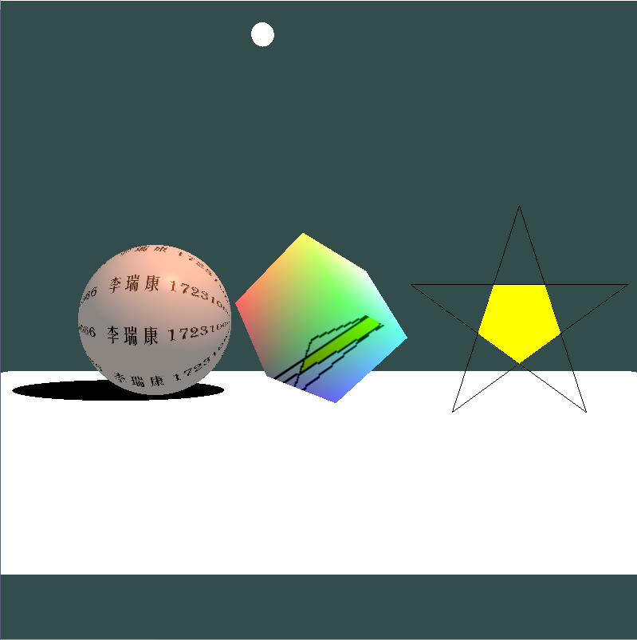

# BUAA图形学作业项目

## 概述

基于OpenGL 3.3和GLFW窗口库完成的指定任务，实现功能包括：

- 绘制了五角星、立方体、球体，通过模视矩阵在全局坐标系中沿直线排列。
- 球体颜色混合了Fhong反射和纹理贴图，其中反射包含环境反射、漫反射、镜面反射。
- 在球体下方绘制了一个平面，平面上呈现球体的阴影。
- 立方体通过不断改变模视矩阵实现旋转，颜色混合了固定颜色和环境映射，环境映射是通过立方体映射实现的。

效果如图：

## 编译运行

### 测试环境

- Windows-x64
- VS 2019

### 直接运行exe

- 进入`x64/Release`目录，直接运行exe文件。

### 手动导入VS项目

1. 在VS 2019中创建空项目。
2. 将源码根目录`Include`、`Lib`、`Resource`目录复制到VS项目根目录下；将源码根目录下`.c`、`.cpp`、`.h`文件复制到VS项目根目录下并包括在VS项目中。
3. 在VS 2019中将项目编译平台设置为x64.
4. 在VS 2019 项目属性->VC++目录 中添加：包含目录`Include`、库目录`Lib`。项目属性->链接器->输入 中添加附加依赖项：`opengl32.lib`、`glfw3.lib`。
5. 生成解决方案并运行。

## 使用的开源库

- `Lib/OpenGL32.Lib`：Windows自带的OpenGL库文件。
- `Lib/glfw3.lib`、`Include/GLFW`、`Include/KHR`：OpenGL窗口库GLFW，在Windows上支持OpenGL 3以上版本。
- `glad.c`、`Include/glad`：glad库，用于加载具体硬件平台上OpenGL相关函数。
- `Include/glm`：数学运算库glm，封装了矩阵运算等。
- `stb_image.h`、`stb_image.cpp`：stb_image库，用于 加载纹理图片。
- `LearnOpenGL`教程：部分功能实现参考了教程 [LearnOpenGL](https://learnopengl.com/)，可以在 [LearnOpenGL CN](https://learnopengl-cn.github.io/) 找到教程的部分中文翻译。

## 功能实现说明

### 矩阵变换

- 模视矩阵model，通过glm提供的平移`translate`、缩放`scale`、旋转`rotate`构建矩阵。
- 观察矩阵view，定义摄像机的位置、指向坐标、方向向量，通过glm提供的`lookat`构建矩阵。
- 投影矩阵projection：项目中一律采用透视投影，通过glm提供的`perspective`构建矩阵。

### 五角星绘制

- 顶点位置通过数学计算得出，适用于任意顶点数的星星，修改`ANGLE_NUM`常量为5以外的值即可。
- 分解为5个线框三角形和5个填充三角形绘制。
- 顶点着色器`Resource/plain.vs`执行模视、观察、投影变换，片元着色器`Resource/plain.fs`通过`uniform`量设置指定颜色。

### 立方体绘制

- 顶点、法线、颜色数据固定给出，分解为6x2个三角形绘制。
- 顶点着色器`Resource/reflcetion.vs`执行模视、观察、投影变换，通过模视矩阵的不断变化实现旋转效果。片元着色器`Resource/reflection.fs`混合指定颜色数据和环境映射，环境映射的实现将在下文叙述。

### 球体绘制

- 顶点数据通过递归细分得出，以正四面体为初值。每次对三角形$(v_1,v_2,v_3)$，连接外接圆圆心和两个顶点中点分别交外接圆于$v_{12},v_{23},v_{31}$，将三角形$(v_1,v_2,v_3)$替换为四个三角形$(v_{12},v_{23},v_{31}),(v_1,v_{12},v_{31}),(v_2,v_{23},v_{12}),(v_3,v_{31},v_{23})$。迭代多轮后即可近似得到球体，法线数据可相应计算。
- 顶点着色器`Resource/texture.vs`执行模视、观察、投影变换，片元着色器`Resource/texture.fs`混合光照颜色和纹理取样。
- 光照颜色包括环境光、漫反射、镜面反射。环境光由光源颜色和常量因子相乘得到；漫反射由法线和光照方向点积得到；镜面反射由观察方向和反射方向点积得到

### 阴影绘制

- 阴影等效于以光源为基点，将物体投影到平面上，顶点着色器`Resource/shadow.vs`由物体顶点位置、光源位置、平面Y坐标计算出投影到该平面后的顶点坐标。
- 每次绘制球体两次，一次正常绘制，一次使用`Resource/shadow.vs`将球体投影后，通过片元着色器`Resource/shadow.fs`固定以黑色绘制，即可实现阴影效果。

### 环境映射

- 通过立方体中间映射，即天空盒实现。
- 建立6个帧缓存对应天空盒的6个面，每次绘制立方体前，先绘制6次五角星。每次使用从天空盒的一个面观察对应的摄像机参数，绘制到该面对应的帧缓存，6次绘制后得到了一个完整的天空盒纹理。在立方体的片元着色器`Resource/reflection.fs`中即可通过坐标在天空盒纹理上采样，得到纹理颜色。